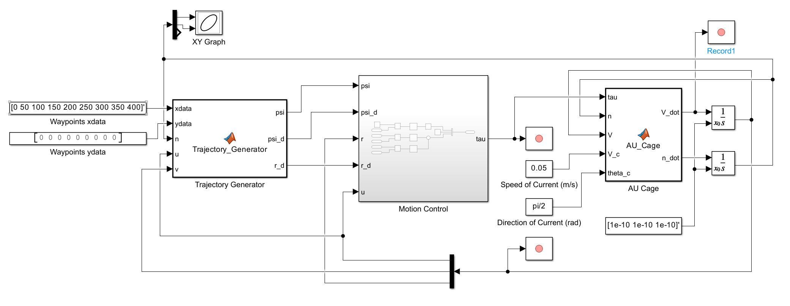
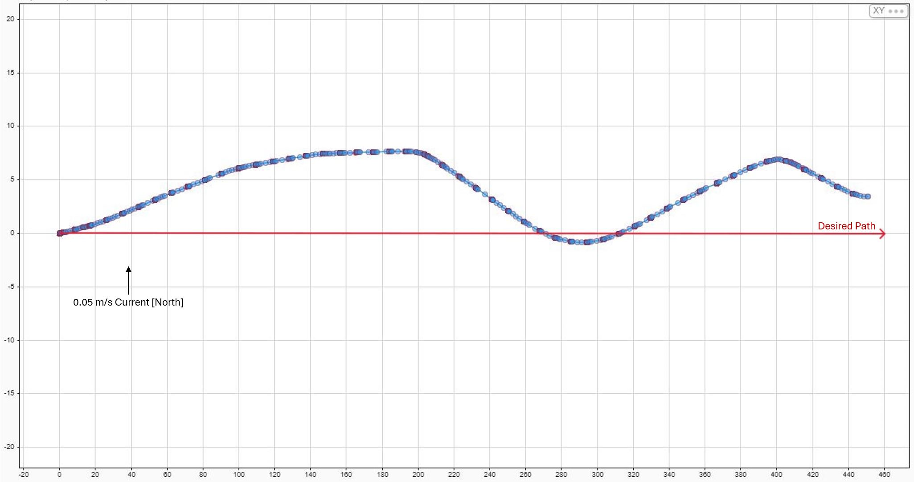
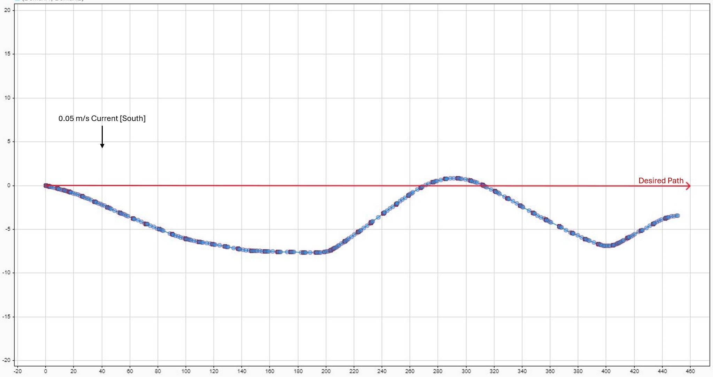

# Control System for Mobile Aquaculture Cages

## Description

Guidance, Navigation, and Control (GNC) system for an autonomous aquaculture cage, implemented in Matlab and Simulink. The cage is a 3DOF system and is fixed along the z-axis at a constant value below the surface of the ocean. Hydrodynamic equations of motion are used from the "Handbook of Marine Craft Hydrodynamics and Motion Control" by Thor I. Fossen and simplified for a 3DOF system. For this model, the cage has a propeller at the back and a means of rotation about the z-axis so control is implemented in the forward (surge) direction and in rotation about the z-axis. No control is applied to the lateral (sway) direction. In other words, the cage's control system is designed to follow a desired path by providing thrust in the surge direction and steering/rotation about the z-axis. The control objective is to maintain a surge speed of 0.2 m/s and travel to waypoints along a desired path within a defined threshold.

## Tests

The desired path for testing the control system was a 400 m straight line in the East (+x) direction. Two test were conducted with perpendicular ocean currents, one in the North (+y or pi/2) direction and one in the South (-y or -pi/2) direction. The results for both tests can be seen below:

### Ocean Current in the Northward Direction

### Ocean Current in the Southward Direction

## Conclusion

As seen above, the control system is able to guide the cage along the desired path while perpendicular ocean currents are pushing it away from the path. The cage only deviates at most 7 m from the path over a 400 m journey.

(<a href="#readme-top">back to top</a>)

